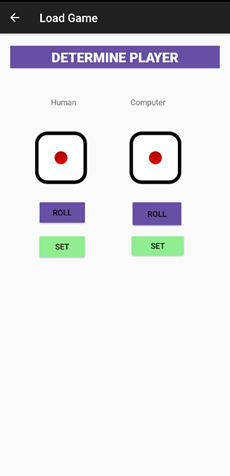
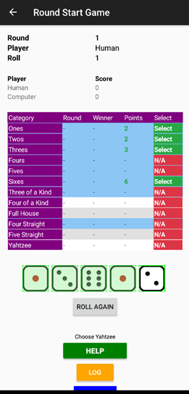

# Yahtzee

## Overview
This project is a part of the CMPS 366, Organization of Programming Languages (referred to colloquially with a mixture of dread, resentment, and apprehension as "OPL"), course during Fall 2023 at Ramapo College of New Jersey. Yahtzee is implemented in four different programming languages based on different paradigms:  
- **C++**: Structured and object-oriented programming.   
- **Java/Android**: Object-oriented and event-driven programming (with a GUI).  
- **Prolog**: Logic programming.  

This is the **C++ implementation** of Yahtzee.

---

## Implementation in Other Paradigms
- **Object-Oriented & Event-Driven**: Java/Android  
- **Logic**: Prolog  

## Yahtzee Gameplay
Yahtzee is a two-player dice game where players compete to achieve the highest score by strategically filling categories on a shared scorecard.

### Objective
Score the most points by completing as many categories on the scorecard as possible.

### Scorecard Categories
| **Category**         | **Description**                          | **Points**            |
|-----------------------|------------------------------------------|-----------------------|
| Aces                 | Sum of dice showing 1                   | Variable             |
| Twos                 | Sum of dice showing 2                   | Variable             |
| Threes               | Sum of dice showing 3                   | Variable             |
| Fours                | Sum of dice showing 4                   | Variable             |
| Fives                | Sum of dice showing 5                   | Variable             |
| Sixes                | Sum of dice showing 6                   | Variable             |
| Three of a Kind      | At least three dice the same             | Sum of all dice      |
| Four of a Kind       | At least four dice the same              | Sum of all dice      |
| Full House           | Three of one number, two of another      | 25                   |
| Four Straight        | Four sequential dice                    | 30                   |
| Five Straight        | Five sequential dice                    | 40                   |
| Yahtzee              | All five dice the same                  | 50                   |

### Turn Structure
Each player’s turn consists of up to three rolls:
1. Roll all five dice.
2. Optionally set aside any dice and re-roll the remaining dice (up to two more times).
3. Choose a category on the scorecard to fill based on the final dice roll.

---

## Features of the Project

### Core Features
- **Random or Manual Input**: Players can roll dice randomly or manually input values.
- **Computer Strategies**: The computer uses strategies to maximize its score, including category prioritization, optimal re-roll decisions, and standing choices.
- **Dynamic First Player**: The first player alternates based on current scores or a die toss.

### Help Mode
The computer provides recommendations to human players, including:
- The best category to pursue based on the current dice.
- Suggested dice to keep or re-roll.

### Serialization
The game can be saved and resumed:
- **Save State**: At the end of a round, the game state is saved to a file, including the scorecard, player scores, and round number.
- **Resume**: The program can load the saved state and continue from where it left off.

### Beautiful Interface
The interface displays scores and game progress in a clear, intuitive manner.

### Images from the Android App

#### Main menu

#### First player determine

#### Winner of the first dice roll

#### Main game screen layout

#### Human asking for help(above help button

#### Computer scoring Full house In Round 7 and displaying scores

#### Computer Keeping [2,2] and program displaying potential categories
![Computer Keeping [2,2] and program displaying potential categories](images/Picture7.png)

#### Computer scoring 3 of a kind

#### Program displaying log of computer Scoring 3 of a kind  

#### Display Winner in GUI

#### Display Winner in Logs

#### Saving a game and loading a saved game

#### Loading the saved game

